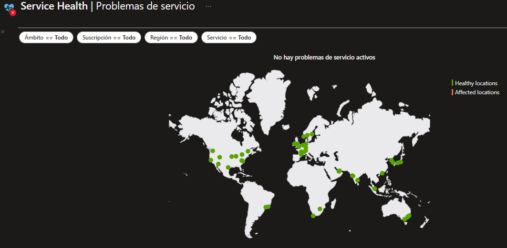
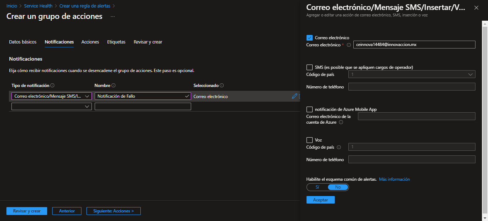
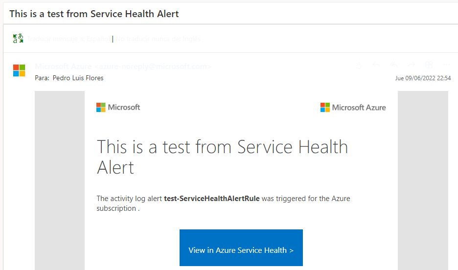
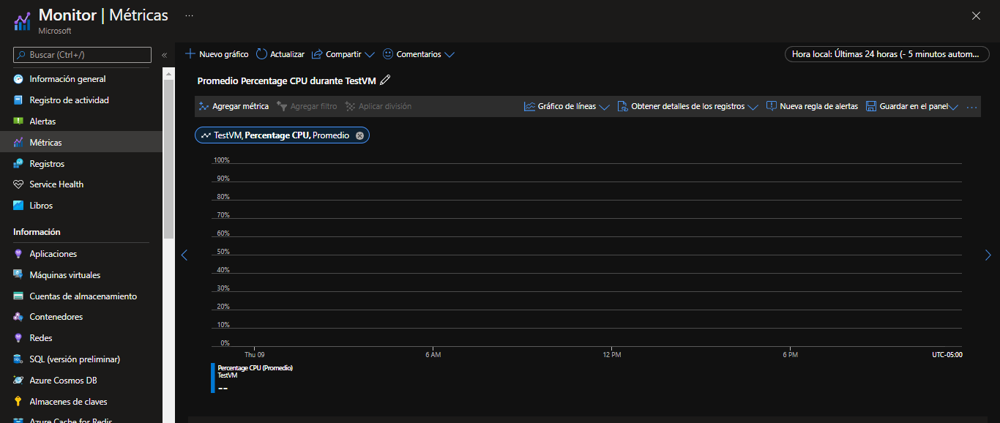
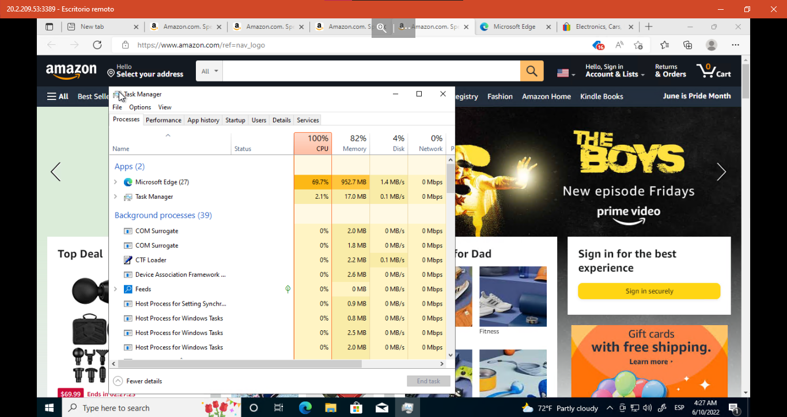
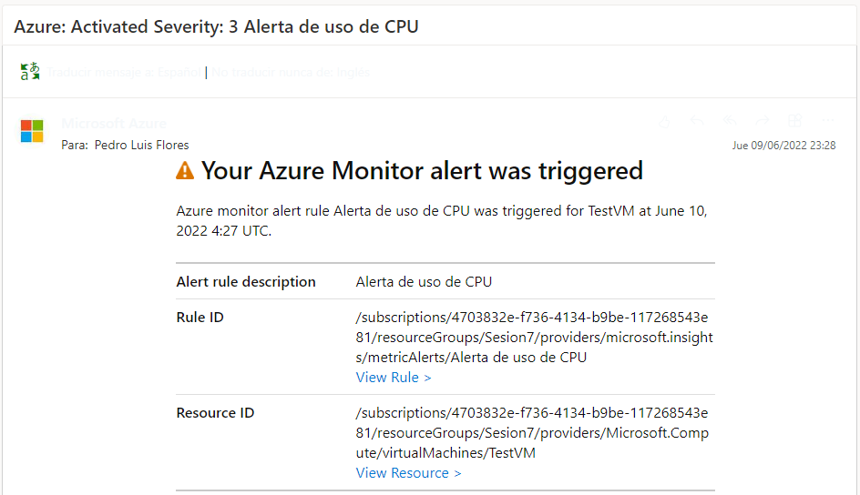
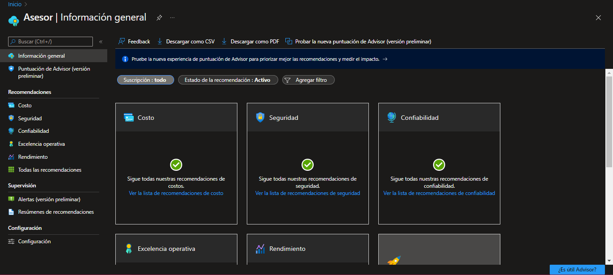
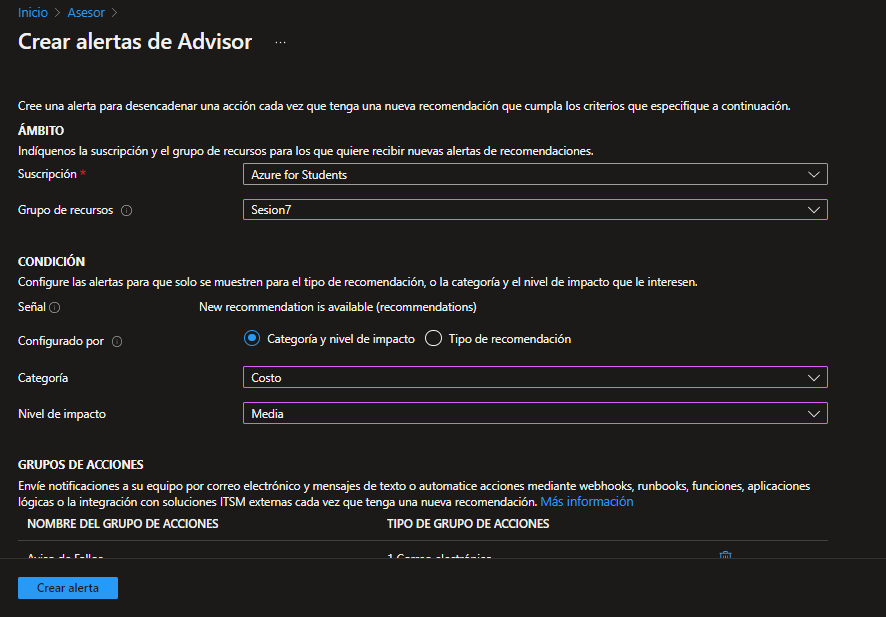

### Sesion 7: Manejo profesional de la nube

En esta sesión conocimos diversas herramientas para una mejor administración y monitoreo de los recursos que nos ofrece la nube de Azure.

##### Azure Service Health

Este se encarga de revisar el estado de nuestros recursos y nos notifica de fallas existentes en cada region.

Es posible hacer que nos llegue una notificación por correo en caso de que algun recurso nuestro se encuentra en una región con falllas y/o mantenimientos programados.

Para esto, es necesario seleccionar la opción _Crear alerta de Service Health_ y seleccionar los servicios de los cuales queremos recibir alertas en caso de fallos.

Luego, hay que crear un grupo de acciones en el cual hay que determinar qué medidas tomará Azure para notificarnos de los fallos.

De esta manera, nos llegará un correo cada vez que se presente una falla en los recursos seleccionados.

Este es un correo de prueba de cómo llegarían los correos.

##### Azure Monitor

Este servicio de encarga de monitorear y supervisar el rendimiento de las aplicaciones. Un ejemplo sería el monitoreo del estado de CPU de una maquina virtual.

Primero hay que seleccionar, en el apartado de Metricas de la interfaz de _Azure Monitor_ y trackear el porcentaje de uso de la CPU de nuestra Maquina Virtual.

Para hacer que nos notifique, es necesario seleccionar la opción "Nueva regla de alerta" y hacer que nos notifique cada vez que el porcentaje de uso de la CPU sea mayor al 50%, solo por fines de la practica.

Una vez logrado, un correo llegará a nuestra baneja de entrada, informandonos sobre la situacion

Esta es una buena manera de monitorear el uso de uno o más dispositivos, para llevar un control de estos.

##### Azure Advisor

Este asesor de Azure, nos proporciona recomendaciones creadas mediante una IA especificamente para nuestra cuenta.
Con esta herramiento, podemos mejorar nuestra cuenta y saber en qué ambitos podemos mejorar.

En este servicio igualmente se pueden establecer alertas de recomendaciones importantes por correo, y para establecer esto es necesario acceder a la sección "Alertas" y crear una alerta de Advisor.

Un ejemplo del uso de esto, sería cuando se contrata una maquina virtual de alto nivel, pero solo se esta usando un porcentaje muy bajo de sus recursos, por lo que sería recomendable bajar su nivel para reducir los costos.

